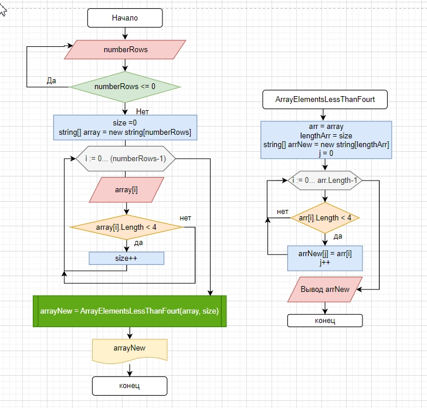

## Задача: ##
### Написать программу, которая из имеющегося массива строк формирует новый массив из строк, длина которых меньше, либо равна 3 символам. Первоначальный массив можно ввести с клавиатуры, либо задать на старте выполнения алгоритма. При решении не рекомендуется пользоваться коллекциями, лучше обойтись исключительно массивами. ###

## Примеры: ##
### [“Hello”, “2”, “world”, “:-)”] → [“2”, “:-)”][“1234”, “1567”, “-2”, “computer science”] → [“-2”][“Russia”, “Denmark”, “Kazan”] → [] ###

# Решение #

### Описание основной программы ###
1. Для очистки терминала используем команду *Console.Clear()*.
2. C помощью цикла *while* получаем натуральное число в переменную *numberRows* (количество строк в будующем массиве *array*).
3. Объявляем переменную *size* (для хранения в ней в последующем размера нового массива), присваиваем ей нулевое значение.
4. Создаем массив строк *array* размером *numberRows*.
5. С помощью цикла *for* заполняем массив *array* строковыми значениями и тут же считаем строки в массиве, длина которых меньше четырех, сохраняя количество таких строк в переменную *size*.
6. C помощью функции *ArrayElementsLessThanFour*, введя аргументы *array* и *size*, получаем массив строк *arrayNew*, в котором длина строки меньше четырех символов.
7. Выводим первоначальный массив и массив со строками, длина которых меньше, либо равна 3 символам.

### Описание функции *ArrayElementsLessThanFourt* ###
1. Создаем новый массив строк *arrNew* размером *lengthArr*.
2. Объявляем пременную *j*, которую будем использовать как счетчик элементов для массива *arrNew*.
3. С помощью цикла *for* обходим все элементы массива *arr*, проверяя количество символов в элементах. Если в элементе количество символов меньше четырех, то заполняем этим элементом массив *arrNew*, увеличивая его счетчик *j* на единицу.
4. После заполнения, возвращаем массив *arrNew*.

